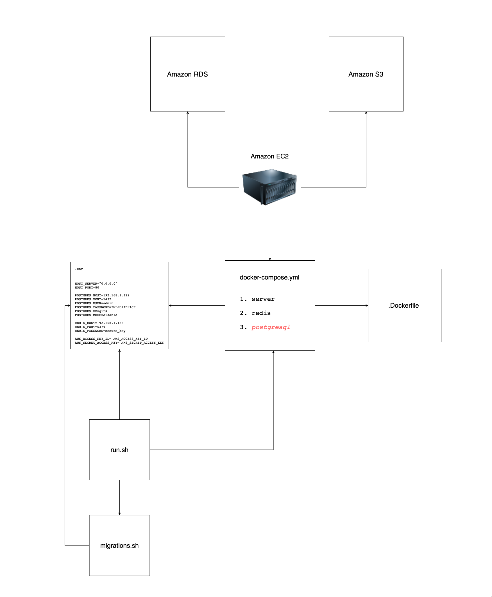

# General

Let's tell you about **main idea of the application**. Person who's own this web application can publish any article and connect articles with tags. User must write content with `markdown` syntax. `Markdown` convert to `html` and display in presentable view.

## Project schema

## Development environment

For comfort developing. The app has development environment. To set up your development environment, you should work with the files in the `/build/dev` folder.

Run the command to start the environment: `./run.sh dev_up`

Clear all data inside dockers you could use command:
`./run.sh stop`

The docker container has configured server with `Delve`. It's debugging tool for Go. This allows you to debug the code that resides inside the docker container. Please read the instructions to connect `Delve` with your IDE:

1. [VS Code](https://www.kenaqshal.com/blog/debugging-dockerized-go-applications)
2. [Goland](https://blog.jetbrains.com/go/2020/05/06/debugging-a-go-application-inside-a-docker-container/)

Provide all credentials to the `.env` file as in the `.example.env` template. Before that, please setup `s3 bucket`.

Keep the database up to date. Bash script `run.sh` has a convenience options for migration:

1. `./run.sh dev_migrate_up` make the latest changes to the tables
2. `./run.sh dev_migrate_drop` drop tables and contents

## Production environment

The production environment provides high performance and a small deployment size. You must use the environment in production mode. To work with production environment switch to folder `/build/prod`

Advantages over **development environment**:

1. Server build without delve tool and third party libraries
2. Does not include postgresql docker

Run the command to start the environment: `./run.sh prod_up`

Provide all credentials to the `.env` file as in the `.example.env` template. Before that, please setup `s3 bucket` and `AWS RDS`.

Keep the database up to date. Bash script `run.sh` has a convenience options for migration:

1. `./run.sh prod_migrate_up` make the latest changes to the tables
2. `./run.sh prod_migrate_drop` drop tables and contents to zero

## Other

Currently, to create a user, you must manually add the account to the database. Create a password for the account You must execute the command: 

`./run.sh generate_pass {passowrd}`

Put your password to brackets.

## Coloboration

### Would you like to make some changes to the repository?

You can do this and prepare pull request to `develop` branch, but follow existing `code style` and [`KISS`](https://en.wikipedia.org/wiki/KISS_principle) principle. I will be glad if you contribute your effort to the front-end part of the project 😉

### Would you like to see some feature?

You could create some issue to the repository what you would like to see changes in project.